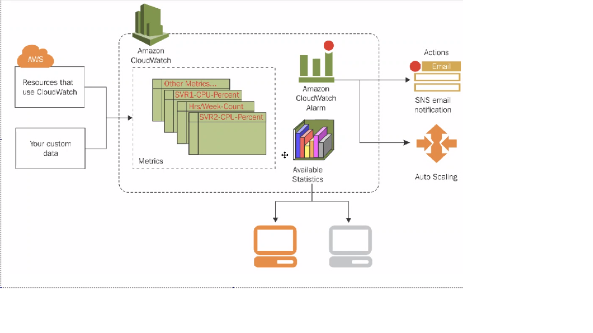

# Cloud Computing & AWS

## Defining Cloud Computing

- Have computational resources or services available via a network, rather than restricting to a local machine or facility.
- This can be either on the internet, or on an organisation-internal channel. A hybrid of the two is also possible.
    - An example of this is banking, where confidential data will be managed on an internal cloud, but publically accessible files will be served from a public cloud
- Clouds are used by almost any larger organisation that requires computing services.

## AWS

- Amongst others, one of the biggest providers of cloud services
- used by a lot of companies
- Biggest advantage is that there is no longer a huge upfront cost to obtain machines 
- Also highly scalable with demand (can rent more or less computing capacity as needed)

## AWS Global Infrastructure

- AWS orders their services by Regions, each with mutiple availability zones
- Each region has at least 2 data centers to ensure availability
- Choosing a data center depends on a variety of factors:
    - Latency to data center (from user)
    - Cost of a particular region
    - legal considerations (some countries require data collected there to be handled there)
- Not all services are available in all regions
- Full list of regions and availability zones [here](https://aws.amazon.com/about-aws/global-infrastructure/)

## Common Use Cases

- IaaS(infrastructure as a service): The cloud provider offers only the infrastructure, and it is up to the cloud user to provide the OS, software and configuration
- PaaS (Platform as a Service): The cloud provider offers a platform (computign capacity as well as the operating system). The user must provide software, and configure the machine for purpose
- Saas (Software as a Service): The cloud provider provides a software package, which the user simply has to configure for their purpose.

## AWS Services

- Elastic Compute Cloud `EC2`
- Simple Storage Service `S3`
- Virtual Private Cloud (aka VBirtual Private Network) `VPC`
- Internet Gateway `IG`
- Route Tables `RT`
- Subnets `sn`
- Network Access Control `NALs`
- Security Groups `SG`
- Cloudwatch `CW`
- Simple Notification Service `SNS`
- Load Balancers `LB` - `ALB` - `ELB` - `NLB`
- Autoscaling Groups `ASG`
- Amazon Machine Image `AMI`
- Simple Queue Service `SQS`

Again, note that these are not always available in every region.

## Launching an Instance

- Requires a key. This can eithe rbe created or obtained from an administrator, depending on the organisation's setup.
- The key needs to be moved to a connecting machine's .ssh folder

## Exercise: Setup the node.js app to run in the cloud 
- Important to setup security group to control access. For example, here are the rules that shyoudl govern an instance running the previously contructed app:

```
1. port 22 to be connected to only from admin's IP
2. port 80 accessible to the world (this allows users to access the webpage via http)
3. port 3000 accessible (this is where the app will be listening)
```
- note that it is a good idea to limit the access to the instance as much as possible
- Make sure to follow org's naming convention for both security groups and app names
- if in doubt, AWS does provide guidance during the launching process.

### Provisioning the EC2 instances

### App Instance
These are essentially the same steps as before:
- Update and Upgrade
- install nginx
- nginx enabled
- check public IP globally

- install correct version of node & required dependencies
- upload app files using the `scp` command
- npm install
- npm start

The exact commands are the same as those in the previous `provision_app` sript, and it is possible to copy these across with scp.

**Important note: The following variables have to be updated**

- The `DB_HOSTS` variable (should become mongodb://[DB_INSTANCE_IP]:27017/posts)
- The `server` address in nginx's modified default file (should match the IP of the app instance)

### DB Instance
Now that the app machine is provisioned, need to set up the database instance.

Requirements are:

```
- allows port 22 access from admin machine
- allows access to mongodb port for the app instance

- mongodb installed
- has adjusted mongod.conf
```

The easiest way to set this up is at the security group stage. The steps are:

- First inbound rule: allow port 22 from your (the admin's) IP
- Second inbound rule: Allow port 27017 from the `app` instance

- After launching the instance, simply run the installation commands as they were in the `provision_db` script.


- Once this is done, we can set the environment variable `DB_HOST` on the app instance to the correct port on the db instance, using the latter's IP. For improved quality of life, put hte export command into your `.bashrc` folder to make the environment variable persistent

- With the connection to the database instance secured via `DB_HOST` and the updated IP in the `default` file, restart and re-enable `nginx`.

- All that remains is to switch to your `app` folder, run `node seeds/seed.js` and then install and start `npm`. Congratulations, your app now runs in the cloud.


## AMI

- Short for Amazon Machine Image
- Allows the saving of a machine's settings 


### Creating an ec2 instance from customised AMI

- Steps are similar to normal ec2 instance using a default AMI
- There are still some instance options to confirm, but first step is taken care of
- Still need some info
    - Security Group ID
    - VPC Subnet
    - Any other dependencies
    - Type of instance, size of EBS - storage required
    - Whether a public IP is required

### Dealing with Demand

- Big advantage of AWS and similar cloud services is the ability to scale with traffic
- AWS does provide the ability to automatically scale with demand
- Start with monitoring with Cloudwatch
    - This raises when a level is reached
    - Spin up autosclaing group
    - A load balancer then rebalances the demand.
- It is also possible to deploy architecture in multiple availability zones to defend against potential data center problems.

Have to create a listener group that checks machines are up and running.

### Basics of Setting up monitoring

- When viewing an instance, select monitoring.
- This shows stats such as CPU utlisation percentage, disk write, and so forth
- Can add information to a dashboard


- need to enable detailed montioring under `manage detailed monitoring`

    -this does cost more, so use with caution

- add the monitoring to a dashboard of choice

- next, in instances, either select the `+` sign next to your instances "alarm status" field, or enter the alarm creation menu via `actions -> monitor and troubleshoot ->Manage CloudWatch Alarms`

- Name your alarm, and set the threshold you would like to be notified by

- if you have an SNS group already set up, you can link it here

- Otherwise, enter the Cloudwatch dashboard and edit the alarm

- Add a new SNS group, and add the email addresses you would like to have notified when the alarm is triggered

- You should now receive an email asking you to confirm the subscription

- Congratulations, AWS will now let you know when your instance triggers an alarm!


Full guide to editing or setting up an alarm [here](https://docs.aws.amazon.com/AmazonCloudWatch/latest/monitoring/Edit-CloudWatch-Alarm.html)

More on SNS groups [here](https://docs.aws.amazon.com/sns/latest/dg/sns-create-topic.html)

## Monitoring Concepts



- A variety of things may need to be monitored
- This depends on the app and infrastructure, but a general guideline (applicable to our example app) might be:
    - CPU utilisation
    - Number of requests, response times, latency
    - The Firewall
- Which particular resources are to be monitored and and how frequently is also important. For example, some resources may only need to be checked over once every couple of hours
- Other questions include the choice of tools, and who will be responsible for keeping track of monitoring and responding
- Also need to ensure the correct people are notified when alarms are triggered

#### The 4 Golden Signals of Monitoring

These are considered the basics of monitoring virtual infrastructure. They are:

- Latency
    - the time taken to service a request.
    - Important because slow responses indicate performance degradation or insufficient resources
- Traffic
    - Number and type of requests with time
    - Important as this shows which services are beign used and how often (e.g. how many database requests an app is havign to make or how many sessions are active concurrently)
- Errors
    - The rate of requests returning an error code
- Saturation
    - How close to maximum utilisation resources are
    - Very important as ability to provide service may decrease the closer to full utilisation an instance is


## Responding to Monitoring

AWS' default monitoring service is Amazon Cloudwatch, which can be used for most of their resources. Key is to attempt to automate responses to monitoring. This can be done most easily with auto-scaling groups. For example, if demand peaks and services go beyond a particular utilisation, it would be useful to spin up additional instances. Defence against DDoS attacks and similar types of attempts by potentially malicious users is also available as a service, though the technical details are beyond the scope of these notes.

- Aamazon offers notifications to the user, which were implemented as previously described. 
- There are also services to queue requests (SQS, or Simple Queueing Service)
    - This holds requests and processes them in turn, avoiding reqturning error codes.
- Amazon Lambdas are a way of increasing capacity by only the amount used.


A good idea is to split various metrics into separate dashboards, so that particular signals or instance types might be monitored by dedicated teams (for example a team dedicated to monitoring and analysing traffic, or a team concerned with saturation of a database server)

## Automating Monitoring on a sample app

- Application Load Balancer
- Autoscaling Group
- Launch template configuration - how many instances should be running at all times
    - Minimum and maximum required (e.g. min=2, max=3)
- Policy on scaling out and scaling in
    - This is necessary to avoid paying for services that are not needed

- Scaling on Demand (Terminology)
    - Scaling Up versus scaling out: Scaling up means making components on an instance bigger to meet demand (e.g. increasing CPU capacity). Scaling outmeans increasing the number of instances
    - Scaling to demand is generally best done by sxcaling out, as the previous configuration is known to be working.

# S3 - Simple Storage Service & AWS CLI
### Quick intro to AWS CLI
- AWS CLI is the command line interface for AWS. This exists as an alternative to the traditional interface
    - Available through the AWS developer's toolkit. Can be installed and used on any EC2 instance.
    - Allows doing CRUD operations without needing to go through the multi-step AWS console.


**To create AWS CLI**
- Require dependencies: python 3 and above
- AWS access and secret keys
- S3 access through our IAM role
- Note: It is also necessary to create an alias for python3 as python.
## S3 buckets
- These are simply storage for objects. Used to store and protect data
- Highly scalable and usable for any amount of data
- Very useful in disaster recovery planning
- Also allows data to be persistent after an EC2 instance is deleted

Once requirements are installed, need to set up key. This is done by typing `aws configure`, after which the programme prompts the input of authentication details and desired output.

Test connection by typing `aws s3 ls` to list the S3 directories. This will nto work if the permissions were entered incorrectly.

### S3 Storage Classes
- Standard
    - Slightly more expensive than Glacier, but useful for data that is frequently accessed as access time is shorter
- S3 Glacier
    - Useful if something does not need to be available straight away.
    - An example might be old employee records, which you are required to keep but would only be required in response to referencing queries

### CRUD in buckets (huehuehue)

- Now that we have discussed how to authenticate, it is time to try out CRUD operations with buckets

- To make a new bucket, use `aws s3 mb s3://devops-bootcamp-kwolff` (mb for make bucket, the last part is an addres and variable)
    - note that bucket naming convention will not accept underscores, but will accept dashes
    - to explicitily force a particular region, use `-- region [region name]`. Otherwise, the default region given during the authentication step will be used.

- Next, let's create a file called `test.md` on our instance and try to store it in the S3 bucket.
    - To do this, use `aws s3 cp [file or filepath] s3://devops-bootcamp-kwolff`. Of course, the filepath for the s3 bucket changes d3epending on the intended bucket name
- The file copied into the s3 bucket is completely separate from the one on the ec2 instance, so editing or deleting it on the instance will not affect the backed up file.
- Retrieval of file works the same way as copying files to the S3 bucket, but with the first filepath being the S3 address, and the second being destination filepath.

- Can also synchronise folders, using `aws s3 sync [s3 filepath] [localhost folder name]`. If this file is not yet existing on the instance, it will be created

- Deletion of filess uses `aws s3 rm [bucket-path]`
- to delete a whole bucket, we need to use `aws s3 rb [bucket path] [bucket name]`
- to empy a bucket or a folder in a bucket (keep the name but delete all files), use `aws s3 rm [bucket path] --recursive [bucket name]`
    - note that hte bucket name needs to be there to confirm the choice, similar to a `-y` in some linux commands

### AWS CLI

Manipulating S3 buckets is only one of the features of the AWS command line itnerface. It is possible to create any aws resource as they are required. this leads neatly onto infrastructure-as-code.

## boto3

This is a python package that can deal with AWS CLI commands, allowign them to be tied into python programs easily. A few sample functions that can be used to apply CRUD operations to s3 buckets can be seen in the `Boto3_python` directory.

# Autoscaling & Load Balancing

- Autsocaling is the automatic adjustment of comptuational resources based on server load. 
- Load Balancing ditributes traffic between instances to avoid one EC2 instance getting overwhelmed. Done by an Application Load Balancer (ALB) 

### Autoscaling group Exercise:

- Want an autoscalign group that has a minimum size, can scale out as needed (to a maximum size), and scale back down when no longer needed
    - for now, start with 2 EC2 instances and scale out to 3 if required.

**To create and autoscaling group**
```
- Need an ASG: Dependent on having either a launch tmeplate or launch configuration available.
- ALB: Target group HTTP 80, 
- AWS keys
- VPC - Subnets - Security Group


To make highly available, want to deploy in mutliple availability zones, for example first instance in Ireland, second in London, third in Paris. Ideally keep latency low by not having availability zones spaced too far apart.

Info Needed:
- AMI-id
- EBS storage

```

To launch an autoscaling group, need to start with an AMI. This will then be used to set up a launch template:

```
- Select 'Launch Template'
- Select the AMI that you want to use, and configure the other options to fit your.
- under "user Data", it is advisable to add a bash script with the actions required to bring the app online.
- Add the security group of choice and so on, similar to an instance launch

```

With the launch template set up, we can use this to configure an autoscaling group

```
- Click on the autoscaling group option
- Create a new autoscaling group
- Add your launch template when prompted
- Set the limitations for scaling up
```
The autoscaling group can be set to have a minimum and maximum number of instances.

