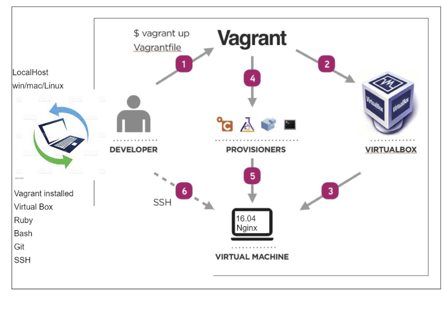

# Vagrant

Vagrant is a means of automating the setup of virtual machines. The instructions are saved in a vagrantfile. This ensures everyone is working in the same environment, and stops bugs from being blamed on a difference between machines.




## Vagrantfiles

These can be updated, but to apply the changes to the virtual machine, it is necessary to use ```vagrant reload```, or to destroy and rebuild the virtual machine.

### Automating Provisioning

This is done in order to package all requirements associated with a project.

One way to provision is via a shell script on the virtual machine. This has to be set to be executable using ```chmod + [filename]```

```
#!/bin/bash

#update system and upgrade packages
sudo apt-get update -y
sudo apt-get upgrade -y

#install nginx
sudo apt-get install nginx -y
```

Can also synchronise folders, using the commands shown in the vagrantfile contained in this directory.
Full vagrantfile is as below:

```
Vagrant.configure("2") do |config|

 config.vm.box = "ubuntu/xenial64"
# creating a virtual machine ubuntu 
# assign IP so that any webapps are accessible on host machine
 config.vm.network "private_network", ip: "192.168.10.100"
 #to get this working, require hostsupdater to be instlaled on localhost 
 config.hostsupdater.aliases = ["development.local"]
 
 # Sync folder from OS to VM
 config.vm.synced_folder ".","/home/vagrant/app"

end
```

Finally, it is more efficient to simply run the shell script as part of the ```vagrant up``` procedure. This is done by adding the below line as a final step before ```end``` :

```
config.vm.provision :shell, path: "provision.sh"
```

This runs the ```provision.sh``` script, provided the path is given correctly. With all things working, we have now set upa virtual machine running a webserver, and can do so again with a single command.


# Appendix: Full List of Vagrant Options

These can also be brought up by simply typing ```vagrant``` in the command line after vagrant is installed:

```
Usage: vagrant [options] <command> [<args>]

    -h, --help                       Print this help.

Common commands:
     autocomplete    manages autocomplete installation on host
     box             manages boxes: installation, removal, etc.
     cloud           manages everything related to Vagrant Cloud
     destroy         stops and deletes all traces of the vagrant machine
     global-status   outputs status Vagrant environments for this user
     halt            stops the vagrant machine
     help            shows the help for a subcommand
     hostsupdater
     init            initializes a new Vagrant environment by creating a Vagrantfile
     login
     package         packages a running vagrant environment into a box
     plugin          manages plugins: install, uninstall, update, etc.
     port            displays information about guest port mappings
     powershell      connects to machine via powershell remoting
     provision       provisions the vagrant machine
     push            deploys code in this environment to a configured destination
     rdp             connects to machine via RDP
     reload          restarts vagrant machine, loads new Vagrantfile configuration
     resume          resume a suspended vagrant machine
     snapshot        manages snapshots: saving, restoring, etc.
     ssh             connects to machine via SSH
     ssh-config      outputs OpenSSH valid configuration to connect to the machine
     status          outputs status of the vagrant machine
     suspend         suspends the machine
     up              starts and provisions the vagrant environment
     upload          upload to machine via communicator
     validate        validates the Vagrantfile
     version         prints current and latest Vagrant version
     winrm           executes commands on a machine via WinRM
     winrm-config    outputs WinRM configuration to connect to the machine

For help on any individual command run `vagrant COMMAND -h`

Additional subcommands are available, but are either more advanced
or not commonly used. To see all subcommands, run the command
`vagrant list-commands`.
        --[no-]color                 Enable or disable color output
        --machine-readable           Enable machine readable output
    -v, --version                    Display Vagrant version
        --debug                      Enable debug output
        --timestamp                  Enable timestamps on log output
        --debug-timestamp            Enable debug output with timestamps
        --no-tty                     Enable non-interactive output
```
# Appendix 2: Useful Links

[Vagrant Docs on Provisioning](https://www.vagrantup.com/docs/provisioning/file)

[Vagrant Docs on Shell](https://www.vagrantup.com/docs/provisioning/shell)